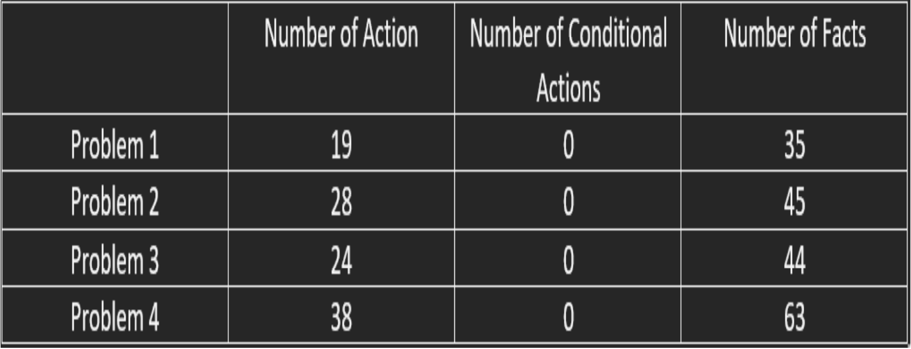

[Artificial Intelligence for Robotics II](https://corsi.unige.it/en/off.f/2022/ins/60237?codcla=10635)<br>
[M.Sc Robotics Engineering](https://corsi.unige.it/corsi/10635)<br>
[University of Genoa (UniGe), Italy](https://unige.it/en)<br>
**Supervisor:** [Prof. Mauro Vallati](http://maurovallati.blogspot.com/)

# AI4RO2_Assignment1: AI Planning

The work is based on AI Planning which involves the demonstration of an automated warehouse for a company. An automated warehouse helps in order management in a precise way which automatically boost the storage capacity.

* Requirements for the assignment [click here](https://github.com/ankurkohli007/Artificial_Intelligent_4_Robotics_2_Assignment_I/blob/main/AIPlanningAssignemnt/Assignment.pdf).
* Report of the assignment [click here](https://github.com/ankurkohli007/Artificial_Intelligent_4_Robotics_2_Assignment_I/blob/main/AIPlanningAssignemnt/AI%20Planning%20Assignemnt_Group%20I_Ankur%20Kohli_Awais%20Tahir_Subhransu%20Sourav%20Priyadarshan.pdf).

## Abstract

This assignment is about *AI Planning* in which the task is to model an automated warehouse scenario in an efficient manner. We presented with some techniques for handling planning problem throughout the course such as *PDDL+/ Numeric planning*, *Numeric and Temporal planning*, and so on. For this assignment, we used *Numeric and Temporal planning* using *LPG 1.2 Planner*. A planner is used to design an application domain and problem (defines the initial state and goal state), and also to generates a plan.

## Introduction

In this task, we considered the warehouse where we need to implement the AI Planning to automated the warehouse. We taken the scenario in which we are having two ***mover robots*** whose task to moves the crates from the initial position in the warehouse and drop at the loading bay which is near to the conveyor belt. The crates are to be loaded on the conveyor belt by an additional robot named as ***loader robot***. We also have to keep in mind that the weight of the crates is not the same. Some are light-weight, some are fragile while others are heavy-weight. Light crates, (<50kg) can be moved around by a single mover robot while heavy crates (>50kg) need two robots for obvious reasons. Also, light crates can be moved by two mover robots. The time required to move the crate depends on the weight. Hence the formula is used for the time calculation of light crates using single mover robot distance * weight / 100 (for light crates). For heavy crates the time calculation is as same of light crates. As mentioned above light crates can also be carried by two mover robots for this case the time calculation formula will change and calculated by using distance * weight / 150 (for heavy crates). There are also fragile crates. Fragile crates can be heavy or light it’s depend. These fragile crates need extra care to carry from the warehouse to the loading bay. But fragile crates will be carried by two mover robots whether the weight of a fragile crates is less than 50 Kg or more. Also, the time calculation formula for fragile crates will be same as of heavy and light crates. The only change in the speed of the mover robot will effect such as if the mover robot takes 4 times unit to carry the other type of crates and it will take 6 time units instead of 4 time units to carry fragile ones.

## Installation of the planner

To design a plan we used a **LPG Planner**. LPG (Local search for Planning Graphs) ia a planner which is based on local search and planning graphs. These will grasps **PDDL 2.1 domains**. This PDDL 2.1 domains associates with numerical quantities and durations. This planner able to solve not only plan generation but also plan adaptation problems. The evaluation function uses some heuristics to estimate the "search cost" and the "execution cost" of achieving a (possibly numeric) precondition.

* **Note:** 
      <ul>
      <li>The planner can be dowloaded from the given [link](https://lpg.unibs.it/lpg/).</li>
      <li>Also, to download the ***lpg++*** file of LPG Planner [click here](http://helios.hud.ac.uk/scommv/storage/lpg++).</li> 
      <li>After downloading and installation of the planner and downloading of executable go to the directory **LPG-1.2-source** -> **LPG** paste the downloiaded executable here. Make sure ***lpg++*** is executable if not make it by using the command ```chmod +x lpg++```.</li> 
      <li> The **LPG Planner** can only be downloaded from the **Mozilla Firefox** serach engine.</li>
      </ul>

## Methodology

The movers always start from the loading bay, and distances for crates are provided as straight line distances. There is no risk of interference on the paths between different crates and the loading bay. 

**Domain file:** It consists of one domain file name as ```warehousetaskplanner.pddl```. 

**Problem file:** There four problem files name as ```warehousetaskplannerproblem1.pddl```, ```warehousetaskplannerproblem2.pddl```, ```warehousetaskplannerproblem3.pddl``` and ```warehousetaskplannerproblem4.pddl```.

* **Problem 1:** In problem 1, there are 3 crates; crate, weight 70kg, 10 distance from loading bay, Fragile crate, weight 20kg, 20 distance from loading bay. Crate in group A for extension 1, and crate, weight 20kg, 20 distance from loading bay. Crate in group A for extension 1.
* **Problem 2:** In problem 2, there are 4 crates; crate, weight 70kg, 10 distance from loading bay. Crate in group A for extension 1, Fragile crate, weight 80kg, 20 distance from loading bay. Crate in group A for extension 1, crate, weight 20kg, 20 distance from loading bay. Crate in group B for extension 1, and crate, weight 30kg, 10 distance from loading bay. Crate in group B for extension 1.
* **Problem 3:** In problem 3, there are 4 crates; crate, weight 70kg, 20 distance from loading bay. Crate in group A for extension 1, Fragile crate, weight 80kg, 20 distance from loading bay. Crate in group A for extension 1, crate, weight 60kg, 30 distance from loading bay. Crate in group A for extension 1, and crate, weight 30kg, 10 distance from loading bay.
* **Problem 4:** In problem 4, there are 6 crates; crate, weight 30kg, 20 distance from loading bay. Crate in group A for extension 1, Fragile crate, weight 20kg, 20 distance from loading bay. Crate in group A for extension 1, Fragile crate, weight 30kg, 10 distance from loading bay. Crate in group B for extension 1, Fragile crate, weight 20kg, 20 distance from loading bay. Crate in group B for extension 1, Fragile crate, weight 30kg, 30 distance from loading bay. Crate in group B for extension 1, and crate, weight 20kg, 10 distance from loading bay.

## Running

To run the project, first clone the repository from the command below:
```
git clone https://github.com/ankurkohli007/Artificial_Intelligent_4_Robotics_2_Assignment_I.git
``` 

After cloning the repository make sure the palnner file is executable, if not than make an executable by using the below command: 

```sh
chmod +x lpg++
```
* **Note:** If the one using lpg than the aforementioned command can be executed like ```chmod +x lpg```. 

In order to run the program (lpg) it is necessary to specify the value of three parameters indicating ***a file containing a set of PDDL2.1 operators;*** ***a file containing a problem specification in PDDL2.1 (the facts of the initial and goal states);*** ***the maximum number of desired solutions***. This must be specified using: 

* **o** -> operator file name
* **f** -> problem file name
* **n** -> maximum number of solution

After the executable file execute the following commands for the four different problems:

For problem 1:

```sh
./lpg++ -o warehousetaskplanner.pddl -f warehousetaskplannerproblem1.pddl -n 1
```
* **Note:** As mentioned above if the one using lpg than the above command can be executed like ```./lpg -o warehousetaskplanner.pddl -f warehousetaskplannerproblem1.pddl -n 1```.

For problem 2:

```sh
./lpg++ -o warehousetaskplanner.pddl -f warehousetaskplannerproblem2.pddl -n 1
```

For problem 3:

```sh
./lpg++ -o warehousetaskplanner.pddl -f warehousetaskplannerproblem3.pddl -n 1
```

For problem 4:

```sh
./lpg++ -o warehousetaskplanner.pddl -f warehousetaskplannerproblem4.pddl -n 1
```
Here, the aforementioned commands show that ```./lpg++``` is the planner executable as mentioned above; **-o** is an operator file name i.e. domain file name as ```warehousetaskplanner.pddl```; **-f** is problem file name as ```warehousetaskplannerproblem1/2/3/4.pddl``` whereas, 1, 2, 3, & 4 are the number of problem files; and last but not the least **-n** is the number of solution i.e. 1 in this execution.  

## Outcomes

This section will describes the experimental results which shows the LPG performance using Numeric and temporal Planning problems. The production of LPG was carryout in terms not only CPU-time required to find a results but also the quality of plan computed. This will also defines that how the mover robots actions to carry the crates according to the groups for extension 1 and accomplishing the task. The mover robots starts from the loading bay and move towards the crates initial position i.e. crates at the warehouse. The mover robots will pick up the crates and drop at the loading bay. Now, at the loading bay loader robot will placed the crates on the conveyor belt.



<p align="center">
    <em>Actions of the planner</em>
</p>

The figure above depicts the actions to solve the planner. Also, figure highlights the actions taken by the planer to solve the problems as below:

* **Analyzing Planning Problem:** 
      <ul>
      <li>Temporal Planning Problem: YES </li>
      <li>Numeric Planning Problem: YES </li>
      <li>Problem with Timed Initial Literals: NO </li>
      <li>Problem with Derived Predicates: NO </li>
      </ul>

* **Evaluation function weights:** 
      <ul>
      <li>Action duration 1.00</li>
      <li>Action cost 0.00</li>
      </ul>
      
Below are the figures which shows the results after the plan computed.


<p align="center">
    <em>Computation Result of Problem1</em>
</p>

Figure above explains the results after the plan computation of **Problem 1**. It highlights the action duration i.e. action cost of the plan. Also, describes the plan execution such as mover robots performance to accomplish the goal. 

<p align="center">
  
</p>

<p align="center">
    <em>Optimality of the generated plan by Problem1</em>
</p>

Figure above shows the optimality of the generated plan by Problem1.


<p align="center">
    <em>Computation Result of Problem2</em>
</p>

Above figure highlights the results after the plan computation of **Problem 2**. It highlights the action duration i.e. action cost of the plan. Also, describes the plan execution such as mover robots performance to accomplish the goal.

<p align="center">
  
</p>

<p align="center">
    <em>Optimality of the generated plan by Problem2</em>
</p>

Figure above shows the Optimality of the generated plan by Problem2.


<p align="center">
    <em>Computation Result of Problem3</em>
</p>

Figure above depicts the results after the plan computation of **Problem 3**. It highlights the action duration i.e. action cost of the plan. Also, describes the plan execution such as mover robots performance to accomplish the goal.

<p align="center">
  
</p>

<p align="center">
    <em>Optimality of the generated plan by Problem3</em>
</p>

Figure above explains about Optimality of the generated plan by Problem3.


<p align="center">
    <em>Computation Result of Problem4</em>
</p>

Above figure defines the results after the plan computation of **Problem 4**. It highlights the action duration i.e. action cost of the plan. Also, describes the plan execution such as mover robots performance to accomplish the goal.

<p align="center">
  
</p>

<p align="center">
    <em>Optimality of the generated plan by Problem4</em>
</p>

Figure above shows the Optimality of the generated plan by Problem4.

In the above figures it shows that mover robots is giving first priority to the fragile crates to carry from the initial position to the final position i.e. loading bay.

## Conclusion

Efficient and proper management of the commodities is the need of the hour in the logistics sector. Each and every company, be it a small-scale, medium-scale, or large-scale needs an efficient inventory management system. An automated warehouse providing the maximum efficiency would help these companies deal with the problem of capacity and storage. In the assigned task, we tried to address the problem by proposing and even simulating it which would provide a fruitful outcome. We organized the tasks according to the priority levels and the time assigned to each task was also taken into account thus enabling us to perform the given tasks within the specifications, safety levels, and time consumption. As we are already in the age of Artificial Intelligence, we can already see its impact on the tiniest of areas.
